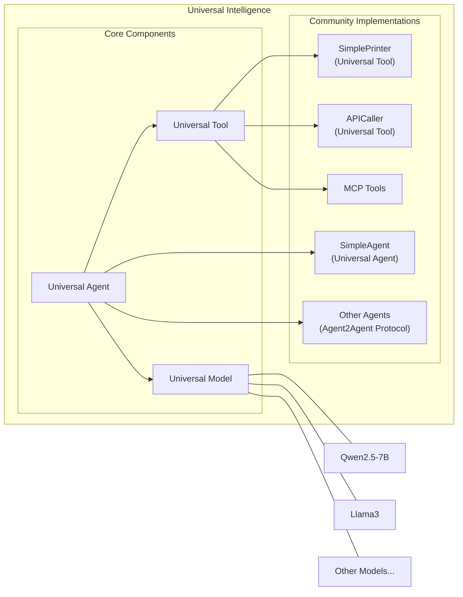
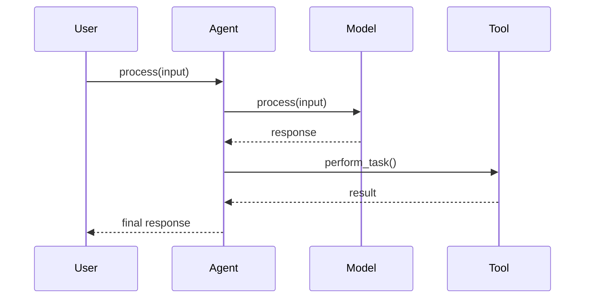
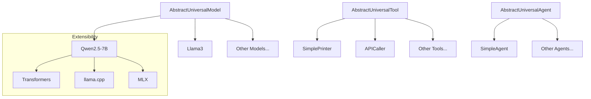
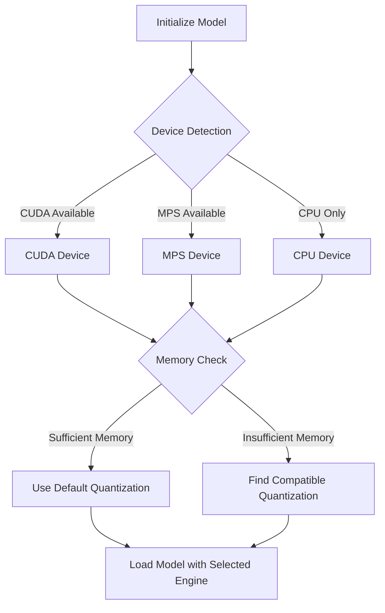

# Universal Intelligence Documentation Plan

This document outlines the comprehensive plan for analyzing the `universal-intelligence` repository and creating architectural documentation.

## Analysis Approach

I'll systematically analyze the codebase with the following steps:

1. **Initial Review**
   - Start with `README.md` to understand project goals and overview
   - Examine project structure and organization

2. **Core Components Analysis**
   - Review abstract classes in `universal_intelligence/core/`
   - Map interfaces, contracts, and type definitions
   - Analyze component relationships and interactions

3. **Community Contributions Analysis**
   - Examine implementation patterns in models, agents, and tools
   - Identify extension mechanisms and plugin architecture
   - Analyze configuration patterns and device optimization strategies

4. **Data Flow & Interaction Patterns**
   - Map request/response patterns between components
   - Document initialization and configuration flows
   - Analyze extensibility and composition patterns

## Documentation Structure

```
docs/
├── 00_system_architecture.md - High-level overview with system diagrams
├── 01_overview.md - Project goals and introduction
├── 02_core_architecture.md - Core interfaces and abstractions
├── 03_plugin_architecture.md - Community component extensibility
├── samples/ - Example implementations inspired by ADK patterns
│   ├── basic_agent.py - Simple model usage
│   ├── tool_using_agent.py - Agent with tools integration
│   ├── multi_agent_system.py - Agents working together
│   ├── rag_agent.py - Retrieval-augmented generation example
│   ├── specialized_agent.py - Domain-specific implementation
│   └── README.md - Sample usage instructions
```

## Visual Diagrams

### 1. System Architecture Diagram



**Component to Code Mapping:**

| Diagram Component | Implementing Class | Source File |
|-------------------|-------------------|-------------|
| Universal Model | AbstractUniversalModel | universal_intelligence/core/universal_model.py |
| Universal Tool | AbstractUniversalTool | universal_intelligence/core/universal_tool.py |
| Universal Agent | AbstractUniversalAgent | universal_intelligence/core/universal_agent.py |
| Qwen2.5-7B | UniversalModel | universal_intelligence/community/models/qwen2_5_7b_instruct/model.py |
| SimplePrinter | UniversalTool | universal_intelligence/community/tools/simple_printer/tool.py |
| SimpleAgent | UniversalAgent | universal_intelligence/community/agents/simple_agent/agent.py |

### 2. Component Interaction Diagram



**Component to Code Mapping:**

| Interaction Step | Method | Source File |
|-------------------|-------------------|-------------|
| Agent receives input | process() | universal_intelligence/core/universal_agent.py |
| Agent calls Model | process() | universal_intelligence/core/universal_model.py |
| Model generates response | Various model implementations | universal_intelligence/community/models/ |
| Agent calls Tool | Various tool methods | universal_intelligence/community/tools/ |
| Tool performs task | Tool-specific implementations | universal_intelligence/community/tools/ |

### 3. Plugin Architecture Diagram



**Component to Code Mapping:**

| Diagram Component | Implementing Class/File | Source Location |
|-------------------|-------------------|-------------|
| AbstractUniversalModel | AbstractUniversalModel | universal_intelligence/core/universal_model.py |
| AbstractUniversalTool | AbstractUniversalTool | universal_intelligence/core/universal_tool.py |
| AbstractUniversalAgent | AbstractUniversalAgent | universal_intelligence/core/universal_agent.py |
| Model Implementations | Various UniversalModel classes | universal_intelligence/community/models/ |
| Tool Implementations | Various UniversalTool classes | universal_intelligence/community/tools/ |
| Agent Implementations | Various UniversalAgent classes | universal_intelligence/community/agents/ |

### 4. Model Engine Selection Flow



**Component to Code Mapping:**

| Flow Step | Corresponding Code | Source File |
|-------------------|-------------------|-------------|
| Device Detection | Device type detection | universal_intelligence/community/models/__utils__/mixins/text_to_text/interface.py |
| Memory Check | Memory availability check | universal_intelligence/community/models/__utils__/mixins/text_to_text/interface.py |
| Quantization Selection | Quantization logic | universal_intelligence/community/models/__utils__/mixins/text_to_text/interface.py |
| Engine Selection | Engine configuration | universal_intelligence/community/models/__utils__/mixins/text_to_text/interface.py |

## Universal Intelligence Sample Examples

Inspired by the Google ADK samples repository, we'll create examples that demonstrate the Universal Intelligence framework's capabilities:

### Basic Agent Example (Simple Model Usage)
```python
# docs/samples/basic_agent.py
from universal_intelligence import Model, Agent

# Initialize a simple model
model = Model()

# Create an agent powered by the model
agent = Agent(universal_model=model)

# Process a simple request
result, logs = agent.process("What is machine learning?")
print(result)
```

### Tool-Using Agent Example
```python
# docs/samples/tool_using_agent.py
from universal_intelligence import Model, Tool, Agent

# Initialize model and tool
model = Model()
printer_tool = Tool()  # Simple printer tool

# Create an agent with the tool
agent = Agent(
    universal_model=model,
    expand_tools=[printer_tool]
)

# Process a request that will use the tool
result, logs = agent.process("Please print 'Hello, World!' to the console")
print(f"Agent response: {result}")
print(f"Tool logs: {logs}")
```

### Multi-Agent System Example
```python
# docs/samples/multi_agent_system.py
from universal_intelligence import Model, Agent

# Initialize a shared model for efficiency
shared_model = Model()

# Create specialized agents
primary_agent = Agent(universal_model=shared_model)
research_agent = Agent(universal_model=shared_model)
fact_checker_agent = Agent(universal_model=shared_model)

# Connect agents to form a team
primary_agent.connect(universal_agents=[research_agent, fact_checker_agent])

# Process a complex request using the team
result, logs = primary_agent.process(
    "Research the impacts of AI on healthcare and verify the key facts"
)
print(result)
```

### RAG Agent Example
```python
# docs/samples/rag_agent.py
from universal_intelligence import Model, Tool, Agent

# Initialize components
model = Model()
api_tool = Tool(configuration={"base_url": "https://api.example.com"})

# Create a RAG-capable agent
rag_agent = Agent(
    universal_model=model,
    expand_tools=[api_tool]
)

# Process a query that requires retrieval
documents = [
    "AI has revolutionized healthcare with early diagnosis systems.",
    "Machine learning models can predict patient outcomes with increasing accuracy."
]

result, logs = rag_agent.process(
    "How has AI impacted healthcare?",
    context=documents
)
print(result)
```

### Specialized Domain Agent Example
```python
# docs/samples/specialized_agent.py
from universal_intelligence import Model, Tool, Agent

# Initialize with a domain-specific model
financial_model = Model(
    configuration={
        "processor": {
            "input": {
                "tokenizer": {
                    "trust_remote_code": True
                },
                "chat_template": {
                    "add_generation_prompt": True
                }
            }
        }
    }
)

# Create domain-specific tools
market_data_tool = Tool(configuration={"api_key": "sample_key"})

# Create specialized agent
financial_advisor_agent = Agent(
    universal_model=financial_model,
    expand_tools=[market_data_tool]
)

# Process domain-specific request
result, logs = financial_advisor_agent.process(
    "What's the outlook for technology stocks this quarter?"
)
print(result)
```

## Implementation Timeline and Priorities

1. **Initial Setup** (Day 1)
   - Create docs directory structure
   - Draft PLAN.md (this document)

2. **Documentation Core** (Days 1-2)
   - Create 01_overview.md
   - Create 02_core_architecture.md
   - Create 03_plugin_architecture.md

3. **System Architecture** (Day 2)
   - Create 00_system_architecture.md
   - Implement all diagrams with code mappings

4. **Example Development** (Day 3)
   - Create all sample examples
   - Create samples/README.md

5. **Review and Refinement** (Day 3)
   - Verify accuracy of all diagrams and mappings
   - Ensure comprehensive coverage of system architecture
   - Test all sample examples

## Conclusion

This documentation plan provides a comprehensive approach to analyzing and documenting the Universal Intelligence architecture. The resulting documentation will combine clear explanations, visual diagrams with code mappings, and practical examples to illustrate both basic usage and advanced capabilities of the framework.
