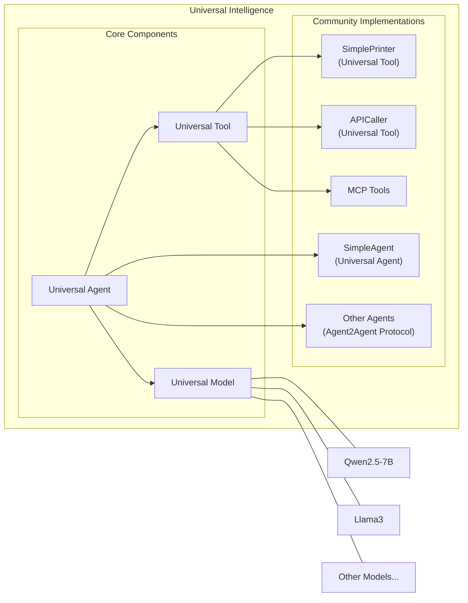
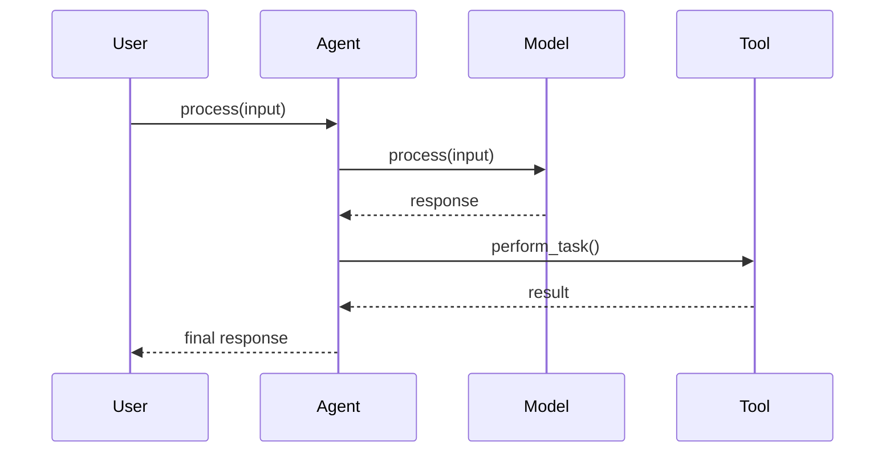
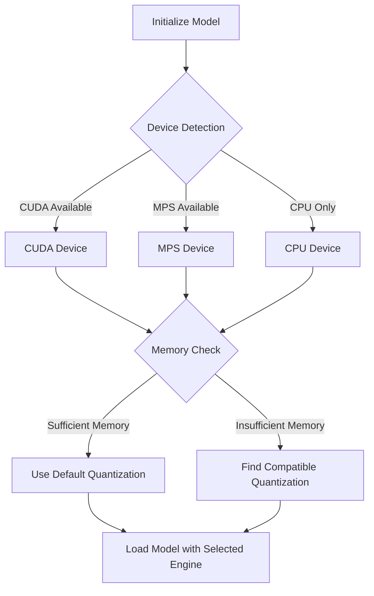
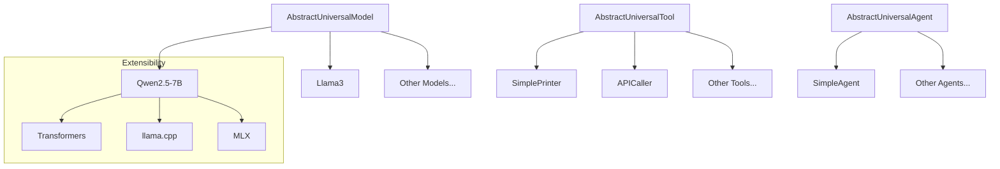

# Universal Intelligence System Architecture

This document provides a high-level overview of the Universal Intelligence architecture, explaining how its components interact to create a standardized, modular framework for AI applications.

## Architecture Overview

Universal Intelligence consists of three primary abstractions:

1. **Universal Model** - A standardized interface for AI models
2. **Universal Tool** - A standardized interface for tools and integrations
3. **Universal Agent** - A standardized interface for agents, composed of models and tools

These components fit together in a composable architecture that enables flexibility, reusability, and efficiency.

## System Architecture Diagram

### Component Mapping

| Diagram Component | Implementing Class | Source File |
|-------------------|-------------------|-------------|
| Universal Model | AbstractUniversalModel | universal_intelligence/core/universal_model.py |
| Universal Tool | AbstractUniversalTool | universal_intelligence/core/universal_tool.py |
| Universal Agent | AbstractUniversalAgent | universal_intelligence/core/universal_agent.py |
| Qwen2.5-7B | UniversalModel | universal_intelligence/community/models/qwen2_5_7b_instruct/model.py |
| SimplePrinter | UniversalTool | universal_intelligence/community/tools/simple_printer/tool.py |
| SimpleAgent | UniversalAgent | universal_intelligence/community/agents/simple_agent/agent.py |

## Key Architectural Features

### Hardware-Aware Design

Universal Intelligence detects the available hardware and automatically selects the most appropriate engine and quantization settings. The system supports:

- **CUDA** - For NVIDIA GPUs
- **MPS** - For Apple Silicon
- **CPU** - As fallback for all systems

The framework also monitors memory availability to ensure optimal resource allocation.

### Standardized Interfaces

All components implement consistent interfaces that follow a contract-based design, making them interchangeable and composable. This standardization enables:

- Swapping models without changing application code
- Adding new tools dynamically
- Building agent teams that share models and resources

### Extensibility System

The architecture supports multiple extension mechanisms:

1. **Community Components** - Pre-built implementations
2. **MCP Integration** - Connection to external tools via MCP servers
3. **Agent2Agent Protocol** - Communication between agents

## Component Interaction Flow

The following sequence diagram illustrates how components interact during a typical workflow:

### Interaction Mapping

| Interaction Step | Method | Source File |
|-------------------|-------------------|-------------|
| Agent receives input | process() | universal_intelligence/core/universal_agent.py |
| Agent calls Model | process() | universal_intelligence/core/universal_model.py |
| Model generates response | Various model implementations | universal_intelligence/community/models/ |
| Agent calls Tool | Various tool methods | universal_intelligence/community/tools/ |
| Tool performs task | Tool-specific implementations | universal_intelligence/community/tools/ |

## Model Engine Selection

The model engine selection process is a key part of the system's hardware abstraction. The diagram below shows the decision flow:

### Engine Selection Mapping

| Flow Step | Corresponding Code | Source File |
|-------------------|-------------------|-------------|
| Device Detection | Device type detection | universal_intelligence/community/models/__utils__/mixins/text_to_text/interface.py |
| Memory Check | Memory availability check | universal_intelligence/community/models/__utils__/mixins/text_to_text/interface.py |
| Quantization Selection | Quantization logic | universal_intelligence/community/models/__utils__/mixins/text_to_text/interface.py |
| Engine Selection | Engine configuration | universal_intelligence/community/models/__utils__/mixins/text_to_text/interface.py |

## Architectural Benefits

The Universal Intelligence architecture delivers several key benefits:

1. **Modularity** - Components can be developed and deployed independently
2. **Reusability** - Components follow standard interfaces, making them interchangeable
3. **Efficiency** - Resources (like models) can be shared between components
4. **Scalability** - New models, tools, and agents can be added without changing the core system
5. **Portability** - The same code works across different hardware configurations

## Plugin Architecture

The Universal Intelligence framework uses a plugin architecture for extensibility, as shown below:

This plugin architecture enables the community to contribute implementations while maintaining compatibility with the core system.

## Technical Implementation Details

The Universal Intelligence framework is implemented in Python, with the following technical characteristics:

- Uses abstract base classes to define interfaces
- Leverages Python's dynamic typing for flexibility
- Employs a configuration-based approach to customization
- Utilizes type hints to improve code quality and IDE support
- Implements factory patterns for component creation and configuration
