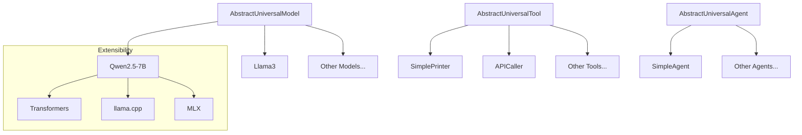
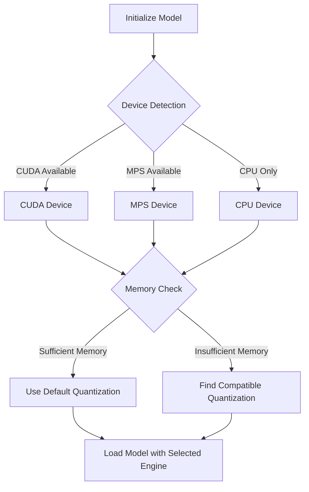

# Universal Intelligence Plugin Architecture

This document details the extensibility mechanisms of the Universal Intelligence framework, focusing on how the community can contribute and extend the functionality of the system.

## Plugin System Overview

The Universal Intelligence framework implements a plugin-based architecture that allows for:

1. **Community Contributions** - Third-party implementations of models, tools, and agents
2. **MCP Integration** - Connection to external services via the Model Context Protocol
3. **Agent2Agent Collaboration** - Communication between agents using standardized protocols

This extensibility is fundamental to the framework's design, enabling it to adapt to new models, tools, and use cases without changing the core system.

## Community Component Extensions

The most direct way to extend the Universal Intelligence framework is by implementing the core abstractions:



### Component Mapping

| Component Type | Abstract Class | Implementation Directory |
|----------------|---------------|--------------------------|
| Models | AbstractUniversalModel | universal_intelligence/community/models/ |
| Tools | AbstractUniversalTool | universal_intelligence/community/tools/ |
| Agents | AbstractUniversalAgent | universal_intelligence/community/agents/ |

### Model Extensions

Model extensions provide implementations of specific AI models using the Universal Model interface.

#### Model Mixin System

Most community models use a mixin-based architecture to share common functionality:

```
universal_intelligence/community/models/__utils__/mixins/
```

These mixins handle:
- Device detection and optimization
- Engine selection and configuration
- Memory management
- Tokenization and generation

#### Model Configuration with YAML

Models use YAML files to specify different engines, quantizations, and configurations:

```
universal_intelligence/community/models/[model_name]/sources.yaml
```

This declarative approach allows models to work optimally across different hardware configurations.

#### Example: Implementing a New Model

A new model can be implemented by:

1. Creating a directory in the models folder
2. Implementing the UniversalModel class using mixins
3. Creating a sources.yaml file
4. Writing tests

```python
# Example of a model implementation
class UniversalModel(UniversalModelMixin):
    _name: ClassVar[str] = "My-New-Model"
    _description: ClassVar[str] = "Description of the model"

    def __init__(self, *args, **kwargs) -> None:
        sources_yaml_path = os.path.join(os.path.dirname(__file__), "sources.yaml")
        self._sources: Sources = generate_sources_from_yaml(sources_yaml_path)
        super().__init__(
            interface_config={
                "name": self._name,
                "sources": self._sources,
                "model_configuration": self._model_configuration,
                "inference_configuration": self._inference_configuration,
                "processor_configuration": self._processor_configuration,
                "chat_template": self._chat_template,
            },
            *args,
            **kwargs,
        )

    @classmethod
    def contract(cls) -> Contract:
        return generate_standard_contract(cls._name, cls._description)

    @classmethod
    def compatibility(cls) -> list[Compatibility]:
        return generate_standard_compatibility(cls()._sources)
```

### Tool Extensions

Tool extensions provide implementations of specific functionality that can be used by agents.

#### Tool Contract System

Tools use a contract system to declare their capabilities:

```python
@classmethod
def contract(cls) -> Contract:
    return Contract(
        name="ExampleTool",
        description="A tool that does something",
        methods=[
            Method(
                name="do_something",
                description="Does something useful",
                arguments=[
                    Argument(
                        name="param1",
                        type="string",
                        schema=None,
                        description="A parameter",
                        required=True
                    )
                ],
                outputs=[
                    Output(
                        type="string",
                        description="The result",
                        required=True
                    )
                ]
            )
        ]
    )
```

#### Tool Requirements

Tools can also specify what configuration they need:

```python
@classmethod
def requirements(cls) -> list[Requirement]:
    return [
        Requirement(
            name="api_key",
            type="string",
            schema=Schema(minLength=10, maxLength=100),
            description="API key for the service",
            required=True
        )
    ]
```

#### Example: Implementing a New Tool

A new tool can be implemented by:

1. Creating a directory in the tools folder
2. Implementing the UniversalTool class
3. Defining the contract and requirements
4. Implementing the tool-specific methods
5. Writing tests

```python
# Example of a tool implementation
class UniversalTool(AbstractUniversalTool):
    def __init__(self, configuration: dict | None = None) -> None:
        self.config = configuration or {}
        self.api_key = self.config.get("api_key")

    @classmethod
    def contract(cls) -> Contract:
        # Tool contract definition here

    @classmethod
    def requirements(cls) -> list[Requirement]:
        # Tool requirements definition here

    def example_method(self, param1: str) -> tuple[Any, dict]:
        # Method implementation
        result = f"Processed: {param1}"
        logs = {"status": "success"}
        return result, logs
```

### Agent Extensions

Agent extensions provide implementations of specific agent behaviors.

#### Agent Process Method

The core of an agent implementation is the `process` method, which coordinates between models, tools, and other agents:

```python
def process(
    self,
    input: Any | list[Message] | None = None,
    context: list[Any] | None = None,
    configuration: dict | None = None,
    remember: bool = False,
    stream: bool = False,
    extra_tools: list[AbstractUniversalTool] | None = None,
    extra_team: list["AbstractUniversalAgent"] | None = None,
    keep_alive: bool = False,
) -> tuple[Any, dict]:
    # Process input and coordinate components
    # ...
    return result, logs
```

#### Example: Implementing a New Agent

A new agent can be implemented by:

1. Creating a directory in the agents folder
2. Implementing the UniversalAgent class
3. Defining the contract, requirements, and compatibility
4. Implementing the process method
5. Writing tests

```python
# Example of an agent implementation
class UniversalAgent(AbstractUniversalAgent):
    def __init__(
        self,
        universal_model: AbstractUniversalModel | None = None,
        expand_tools: list[AbstractUniversalTool] | None = None,
        expand_team: list["AbstractUniversalAgent"] | None = None,
    ) -> None:
        # Initialize the agent
        self.model = universal_model or DefaultModel()
        self.tools = expand_tools or []
        self.team = expand_team or []

    def process(self, input, context=None, configuration=None,
                remember=False, stream=False, extra_tools=None,
                extra_team=None, keep_alive=False):
        # Implement the process logic
        # ...
        return result, logs

    # Implement other required methods
```

## MCP Integration

The Universal Intelligence framework can be extended through the Model Context Protocol (MCP), which provides a standardized way to access external tools and resources.

### MCP Client Tool

The framework includes an MCP client tool that enables communication with MCP servers:

```
universal_intelligence/community/tools/mcp_client/
```

This tool allows Universal Agents to:
- Start and manage MCP servers
- Call tools provided by MCP servers
- Access resources exposed by MCP servers

### MCP Server Integration

External functionality can be integrated through MCP servers that provide:

1. **Tools** - Functions that agents can call
2. **Resources** - Data sources that agents can access

### Example: Using MCP Tools

```python
from universal_intelligence import Agent, Model
from universal_intelligence.community.tools.mcp_client import UniversalTool as MCPClient

# Initialize components
model = Model()
mcp_client = MCPClient(configuration={
    "server_command": "docker run -i --rm mcp/time"
})

# Create an agent with MCP access
agent = Agent(
    universal_model=model,
    expand_tools=[mcp_client]
)

# Process a request that will use MCP
result, logs = agent.process("What time is it in Tokyo?")
```

## Agent2Agent Protocol

The Universal Intelligence framework supports agent-to-agent communication, allowing agents to collaborate on complex tasks.

### Agent Connection

Agents can connect to other agents using the `connect` method:

```python
agent.connect(universal_agents=[other_agent1, other_agent2])
```

This establishes a link that allows the agent to delegate tasks to other agents.

### Agent Communication

When an agent calls another agent, it uses the same `process` method interface, allowing for a consistent communication pattern:

```python
result, logs = other_agent.process(
    input="Delegated task",
    context=relevant_context
)
```

### Multi-Agent Systems

This agent-to-agent protocol enables the creation of multi-agent systems where:

- Agents have specialized roles
- Agents share models for efficiency
- Agents collaborate on complex tasks
- Agents can be added or removed dynamically

## Engine Extensibility

Model implementations can support multiple engines, allowing them to work optimally across different hardware environments.

### Supported Engines

The framework currently supports several engines:

| Engine | Description | Best For |
|--------|-------------|----------|
| transformers | Hugging Face Transformers | CUDA GPUs |
| llama.cpp | C++ implementation of LLaMA | CPU, low memory |
| mlx-lm | Apple's MLX framework | MPS (Apple Silicon) |

### Engine Selection Process

The engine selection process is dynamic and considers:

1. Available hardware
2. Memory requirements
3. Performance characteristics
4. User preferences

This is handled by the model mixins, which detect the environment and select the most appropriate engine:



### Adding a New Engine

The framework can be extended with new engines by:

1. Updating the model mixins to support the new engine
2. Adding the engine to the sources.yaml file
3. Implementing the engine-specific code in the model implementation

## Community Development Guidelines

To contribute new components to the Universal Intelligence framework, follow these guidelines:

### Quality Standards

1. **Comprehensive Testing** - All components should have tests
2. **Clear Documentation** - Document all functionality
3. **Type Safety** - Use type hints
4. **Error Handling** - Handle errors gracefully
5. **Memory Efficiency** - Optimize for memory usage

### Development Workflow

1. **Setup Environment** - Install dependencies
2. **Create Component** - Implement the abstract class
3. **Write Tests** - Test all functionality
4. **Document** - Create comprehensive documentation
5. **Submit** - Contribute to the community

### Testing Tools

The framework provides testing utilities for each component type:

```
universal_intelligence/community/models/__utils__/test.py
universal_intelligence/community/tools/__utils__/test.py
universal_intelligence/community/agents/__utils__/test.py
```

These utilities provide standardized test suites that ensure components adhere to the Universal Intelligence specification.

## Conclusion

The Universal Intelligence plugin architecture provides a powerful and flexible framework for extending AI capabilities. By following the patterns and guidelines described in this document, developers can create new components that seamlessly integrate with the existing ecosystem, enabling a rich and diverse set of AI applications.
